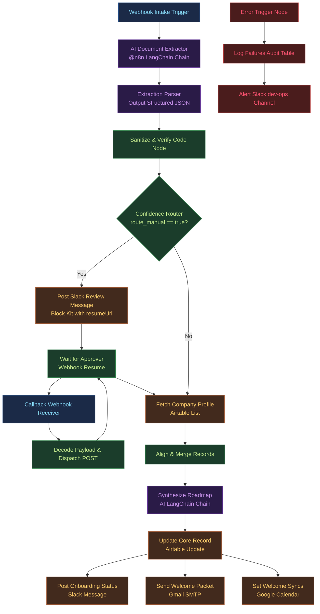

# Enterprise AI Onboarding Automation Architecture
## Technical Design and Architectural Solution

---

### 1. Executive Summary & Core Intent

In mid-sized enterprises (500–2,000 employees), employee onboarding is historically a fragmented, manual process spanning HR, IT, Compliance, and Department Managers. The quality problem is well documented: in Gallup's research, **only 12% of employees strongly agree that their organization does a great job onboarding new employees** ("Why the Onboarding Experience Is Key for Retention," Gallup), and roughly **one in five report their most recent onboarding was poor or nonexistent**. Brandon Hall Group research is frequently cited finding that organizations with a strong onboarding process improve new-hire retention by **82%** and productivity by **over 70%** — indicating the size of the prize for getting onboarding right.

By transitioning to an event-driven, AI-assisted orchestration architecture, the administrative lifecycle is compressed and made consistent: AI handles extraction, normalization, and personalization; deterministic code handles validation and routing; and humans are kept in the loop only for the decisions that genuinely need judgment.

This technical design outlines a hybrid automation architecture using a self-hosted **n8n** orchestration engine integrated with stateful record-keeping systems (such as Airtable or BambooHR) and Large Language Models (LLMs). The core intent is to automate document ingestion, clean intake data, route tasks to the right downstream owner, and synthesize personalized 30/60/90-day roadmaps while maintaining strict regulatory compliance (under CCPA/CPRA, GDPR, Illinois IHRA, and the EU AI Act) and ensuring enterprise-grade fault tolerance.

**FastAPI Python Prototype Demo:** To validate the core orchestration logic, schema parsing, routing decisions, and personalized plan synthesis, a local functional prototype has been implemented in Python using FastAPI (located in `starter/code/`). The prototype utilizes Groq's API (model: `openai/gpt-oss-120b`, a current production model with native structured-output support) to perform field extraction and onboarding plan generation.

---

### 2. Step-by-Step Workflow Logic

The proposed architecture organizes the onboarding process into six distinct stages. Below is the end-to-end technical execution flow:



#### Step 1: Intake & Webhook Trigger (`Webhook Intake`)
*   **System Action:** A new hire submits their intake forms and scans of identification documents (e.g., passport, signed contract). The HRIS or intake portal triggers a `POST` request to n8n's webhook endpoint (`onboarding/intake`).
*   **Data Handling:** The payload contains candidate metadata and binary references or URL endpoints to retrieve the uploaded files.

#### Step 2: AI-Based Extraction (`AI Document Extractor` & `Model - GPT-4o`)
*   **System Action:** The document parser processes the incoming document stream. The LangChain chain passes raw text strings (extracted from PDF/images via OCR) or visual document tokens directly to the LLM (GPT-4o or Gemini Flash) with temperature set to `0.0` for maximum extraction determinism.
*   **Outputs:** Extracts full name, personal email, job title, department, office location, manager name, start date, and missing documentation.

#### Step 3: Verification & Sanitization (`Sanitize & Verify`)
*   **System Action:** A JavaScript Code Node checks the output of the extraction parser.
*   **Validation Rules:**
    1.  **Confidence Score:** Flags records if the model's self-assessed extraction confidence is $< 0.85$.
    2.  **Structural Validation:** Validates email strings against a standard regex (`/^[^\s@]+@[^\s@]+\.[^\s@]+$/`) and checks that the name length is $\ge 2$ characters.
    3.  **Schema Compliance:** Inspects LangChain's output parser for validation flags or schema errors.
*   **Routing Result:** Appends a boolean flag `route_manual` indicating whether the execution requires manual review.

#### Step 4: Routing Decision & Approval Loop (`Confidence Router` & `Wait for Approver`)
*   **Automated Branch (`route_manual == false`):** Bypasses manual review and queries the Airtable employee directory using the extracted email.
*   **Manual Branch (`route_manual == true`):**
    1.  Publishes an interactive Block Kit notification to a Slack admin channel containing candidate metadata and two buttons: "Approve Candidate" and "Reject Intake".
    2.  The workflow pauses at the `Wait for Approver` node, serializing its state to the PostgreSQL database and releasing worker memory.
    3.  The dynamic resume URL (`$execution.resumeUrl`) is embedded directly inside the buttons.
    4.  When an HR manager clicks "Approve", a secondary lightweight *Callback Receiver* workflow receives the interaction webhook from Slack, responds with an immediate `HTTP 200` to satisfy Slack's 3-second timeout rule, decodes the payload, and sends a `POST` request back to the dynamic `resume_url`. The primary workflow then resumes.

#### Step 5: Data Enrichment & Synthesis (`Align & Merge Records` & `Synthesize Roadmap`)
*   **System Action:** The system merges the sanitized intake data with the retrieved corporate directory profile using a left join (`n8n-nodes-base.merge`).
*   **Personalization Engine:** An AI Chain takes the enriched employee profile and constructs a customized 30/60/90-day onboarding plan matching their job role, experience level, and department goals.

#### Step 6: Multi-Channel Provisioning & Communication (`Airtable`, `Slack`, `Gmail`, `Google Calendar`)
*   **Record Update:** Syncs the finalized onboarding plan back to the employee's database record, marking their status as "Active".
*   **System Provisioning:**
    *   Fires email invitations containing welcome packets via Gmail.
    *   Creates calendar invite events for standard team syncs and orientation.
    *   Publishes status updates to Slack onboarding channels.

#### Additional REST API Endpoints & Core Capabilities
To transition the prototype from a simple linear script into an interactive, multi-role HR platform, the following production-grade endpoints have been implemented in the API layer:
1. **JWT-Based Administration Authentication (`POST /auth/login`, `GET /records`, `GET /audit`):** Protects the HR dashboard and compliance logs behind an authentication guard. Admins authenticate via their secure PIN to obtain a signed JSON Web Token (JWT), and all protected routes enforce verification.
2. **Zero-Touch Ingestion Webhook (`POST /webhooks/hris`):** Listens to external HRIS triggers (e.g., offer acceptance notifications from Workday or BambooHR) and initiates zero-touch onboarding ingestion.
3. **Automated De-provisioning Offboarding (`POST /offboard/{id}`):** Coordinates employee offboarding. Triggers system-revocation Slack messages to IT, transitions the employee status to `offboarded`, and records the human actor initiating offboarding in the audit trail. Features a strict idempotency status guard to prevent double-offboarding triggers.
4. **Self-Service FAQ Chatbot (`POST /chat/faq`):** Provides new hires with instant answers to standard policy questions, leveraging low-temperature LLM completions.

---

### 3. Where AI is Used: Architectural Analysis

AI is utilized selectively in this architecture where traditional rule-based programming is insufficient:

| Operational Segment | AI Implementation Pattern | Architectural Advantages | Failure Mitigation & Guardrails |
| :--- | :--- | :--- | :--- |
| **Document Processing & OCR** | Multimodal Visual LLM Ingestion (Gemini 2.5 Flash / GPT-4o) | Successfully extracts structured key-value data from crumpled, rotated, or low-resolution smartphone photographs of IDs and forms. Bypasses the need to maintain rigid spatial templates for every potential form layout. | Visual hallucination risk is mitigated by using a deterministic output schema (JSON Schema) and forwarding any validation anomalies or low-confidence extractions ($< 85\%$) to Slack for manual verification. |
| **Input Normalization & Extraction** | Pydantic Structured Outputs | Eliminates prompt-and-pray fragility by forcing the LLM to output valid JSON matching an explicit schema (e.g., `ExtractedEmployee`). | Type validation enforces field presence; any unparseable output falls back to manual review. |
| **Confidence Anchoring** | Self-Assessed Scoring via Schema | The schema demands a `confidence_score` float (0.0-1.0). The model evaluates its own extraction quality. | Any score $< 0.80$ automatically triggers the Human-In-The-Loop (HITL) review flow. |
| **Personalization Engine** | Contextual Prompt Completion | Synthesizes role-specific 30/60/90-day onboarding roadmaps by cross-referencing candidate background (resume/interview notes) with the target department's core tech stack and objectives. | Generates output in markdown structure restricted by formatting instructions. System templates and cached instructions ensure consistency and control output lengths. |
| **Automated Communication** | Dynamic Email/Slack Drafting | Generates personalized, professional emails to the candidate, warm-welcome team notes, and specific task lists for managers. | Uses pre-defined layout headers and trailers, injecting the AI-generated copy only inside designated template blocks. |

#### Evaluation of Extraction Frameworks: LLMs vs. Cloud-Native IDP
*   **Azure AI Document Intelligence / AWS Textract:** Highly accurate on standard, well-structured documents (e.g., clean tax or government forms) and cost-effective at scale (order of ~$0.01 per page, per public pricing tiers). However, they are brittle when encountering hand-written, skewed, or unstandardized forms.
*   **Multimodal LLMs (Gemini / Claude / GPT-OSS family):** Superior layout comprehension and semantic reasoning on messy input. High-efficiency models keep per-page cost extremely low (a small fraction of a cent per page at current public pricing), making them attractive for variable-quality intake. Verify exact figures against the provider's published pricing at deployment time.
*   **Compilation Latency:** output parsers compiling dynamic JSON schemas can introduce one-time compilation latency on the first request; subsequent calls reuse the cached grammar and run at standard inference speeds.

---

### 4. Prompt Engineering & Prompt Design

Two primary prompts drive the system's AI engines. The prompts utilize clear system roles, strict formatting parameters, few-shot examples, and robust exception-handling instructions to ensure reliable outputs.

#### Prompt 1: Document Intake Extraction & Validation
*   **Target File Reference:** [prompts.md](prompts/prompts.md)
*   **Objective:** Ingest raw text or visual tokens from scanned files and output validated, clean JSON.

```text
You are an expert HR operations data assistant specializing in document verification and parsing.
Your task is to analyze the provided employee intake document and extract the required fields.

Analyze the document carefully. Extract and return the following fields in a flat JSON structure:
- name (string: Full legal name. Capitalize first letters. Minimum length 2.)
- email (string: Corporate or personal email. Convert to lowercase. Verify format.)
- role (string: Proposed job title. Map to nearest standard title.)
- department (string: Target team, e.g., Engineering, Sales, HR, Marketing, Legal.)
- manager (string: Reporting manager's full name.)
- start_date (string: ISO 8601 date format YYYY-MM-DD.)
- confidence_score (float: Your confidence in the extraction accuracy, represented between 0.00 and 1.00.)
- missing_fields (array of strings: Any requested fields that were not found in the input data.)

Constraints:
1. Do not include any pre- or post-markdown blocks (such as ```json). Return ONLY raw JSON.
2. If the document is corrupted, illegible, or contains contradicting data, set the confidence_score to a value below 0.70.
3. If any field is missing, represent it as an empty string "" and append the field name to the missing_fields array.

Input Document text/image:
[INGESTED PAYLOAD HERE]
```

#### Prompt 2: Personalized 30/60/90-Day Roadmap Synthesis
*   **Target File Reference:** [prompts.md](prompts/prompts.md)
*   **Objective:** Ingest sanitized candidate details and output a structured onboarding roadmap in markdown format.

```text
You are an onboarding experience coordinator. Your goal is to draft a personalized, professional 30/60/90-day onboarding plan for a new hire.

Analyze the new employee details:
- Name: {{ $json.employee_name }}
- Role: {{ $json.job_role }}
- Department: {{ $json.department }}
- Manager: {{ $json.reporting_manager }}

Generate a structured markdown document containing the following sections:
1. # Welcome Message: A warm, personalized greeting.
2. ## 30-Day Focus (Integration & Learning): Specific software systems to learn, documents to review, and introductory team syncs.
3. ## 60-Day Focus (Collaboration & Small Wins): Initial small tickets/projects, process shadow sessions, and contribution areas.
4. ## 90-Day Focus (Independence & Contribution): Full ownership of tasks, independent problem-solving targets, and KPIs.
5. ## Key Contacts: List of 3 relevant team roles or members they should connect with.

Guidelines:
- Keep the language encouraging, structured, and professional.
- Tailor the systems and targets to the employee's role and department (e.g., if department is Engineering, focus on Git, local environments, and coding standards).
- Ensure the output is formatted as clean, standard markdown. Do not include any HTML.
```

---

### 5. Integrations & Data Flow

Data moves asynchronously across five core platforms to coordinate onboarding tasks:

1.  **HR Intake Portal / Webhook Ingestion:** Ingests forms and documents. Delivers JSON and file binaries to the orchestrator.
2.  **FastAPI Orchestrator (Python Prototype):** Houses the central execution state. Coordinates LLM API calls, manages validation gates, routes records to the SQLite database, and handles the manual review (HITL) endpoints.
3.  **SQLite (Persistence Layer):** Maintains the source-of-truth records for all personnel and the immutable audit trail. (In production, this swaps to Postgres).
4.  **Slack Integration (Real Webhook):** Posts dynamic welcome messages to a target Slack channel when candidates are approved. *Production path:* Slack SCIM Enterprise Grid integration for automated account provisioning.
5.  **Resend (Real Email API):** Fires personalized HTML welcome packets containing the AI-generated roadmap to the new hire's inbox. *Production path:* Dedicated domain validation and SES/SMTP integration.
6.  **Google Calendar (Mocked):** Simulates scheduling orientation syncs. *Production path:* Google Calendar API via a Service Account with Domain-Wide Delegation to manage employee calendars.

---

### 6. Operational Benefits & Build-vs-Buy Evaluation

#### Build-vs-Buy Framing
Two paths exist for an organization standardizing onboarding:

- **Buy — all-in-one commercial HCM/IT suites** (e.g., Rippling, BambooHR Elite). These are fast to stand up and bundle payroll, compliance, and provisioning, but they bill **per-employee-per-month (PEPM)**, so licensing cost scales linearly and indefinitely with headcount, and onboarding workflows are constrained to what the vendor exposes.
- **Build — a custom automation layer** (self-hosted n8n + an LLM API) layered over a basic HRIS that handles only payroll/tax compliance. This carries a one-time engineering cost and ongoing maintenance, but the marginal cost per new hire is dominated by (cheap) LLM tokens rather than PEPM licenses, and the workflow is fully customizable.

The right choice depends on volume and customization needs: **Buy** wins when headcount is small and requirements fit the vendor's mold; **Build** wins at scale or when onboarding logic needs to differ by role, geography, or business unit. This design assumes the latter and implements the orchestration logic in the prototype under `starter/code/`.

> **Note on cost estimates:** A defensible dollar TCO requires the target customer's actual headcount, PEPM pricing, and engineering rates, which vary widely. Rather than present invented precision here, the recommendation is to compute it per-deployment using the model above (one-time build cost + monthly maintenance + per-hire LLM tokens, against PEPM × headcount × months). The LLM cost component is trivially small at any realistic volume — Groq's `gpt-oss-120b` lists at roughly **$0.15 / 1M input tokens**, so even hundreds of onboarding completions per month cost well under a dollar.

#### Operational Impact (Industry Research)
Rather than quote unverifiable per-hire hour savings, the case rests on widely-cited onboarding research:

| Outcome | Finding | Source |
|:---|:---|:---|
| **Onboarding quality gap** | Only **12%** of employees strongly agree their organization does a great job onboarding new hires. | Gallup — *Why the Onboarding Experience Is Key for Retention* |
| **Retention uplift** | Organizations with a strong onboarding process improve new-hire retention by **82%**. | Brandon Hall Group (widely cited) |
| **Productivity uplift** | The same research links strong onboarding to **70%+** productivity gains. | Brandon Hall Group (widely cited) |

The architecture targets exactly these levers: structured, consistent, automated onboarding (closing the quality gap), personalized 30/60/90-day plans (driving faster productivity), and reduced manual coordination (freeing HR/IT capacity). Per-organization quantification should be measured post-deployment against the customer's own baseline.

---

### 7. Security, Compliance, and Data Sovereignty

Processing sensitive employee personally identifiable information (PII) requires strict data isolation protocols and mapping to regulatory frameworks. The architecture addresses the following regimes:

*   **GDPR Article 22 & SCHUFA Ruling (Automated Decision Making):** GDPR restricts "solely automated decisions" producing legal/significant effects. *Implementation:* We implement a Human-In-The-Loop (HITL) step for any low-confidence extraction or ambiguity. The audit log explicitly records the `override` flag indicating whether the final decision was automated or human-reviewed.
*   **EU AI Act (Annex III High-Risk Systems):** AI systems used for employment and worker management are classified as High-Risk. *Implementation:* The system maintains a rigorous audit trail of every automated action, confidence score, and model version to ensure traceability and human oversight.
*   **Illinois HB 3773 & CPRA (Disparate Impact & ADMT):** Regulations require tracking of Automated Decision-Making Technology and preventing proxy discrimination. *Implementation:* We retain an immutable log of all decisions for a minimum 4-year retention schedule (as mandated by Illinois IHRA).
*   **Zero Data Retention (ZDR):** LLM API requests are configured with the `store: false` parameter (when supported by the provider endpoint) to disable provider-side logging and prevent candidate PII from being used for model training.
*   **Future Enhancements (Not Yet Implemented):**
    *   **PII Masking & Scrubbing (NER):** A local Named Entity Recognition (NER) step to redact direct identifiers (SSNs, birth dates) before routing to external APIs.
    *   **WORM & Hash-Chaining:** Cryptographically linking audit entries in a Write-Once-Read-Many database to guarantee absolute immutability.

---

### 8. Reliability, Fault Tolerance, and Incident Management

Enterprise-grade deployments must remain resilient during downstream API outages or execution errors:

*   **Node-Level Retries:** All critical integrations are configured with automatic retry-on-fail policies to handle transient network issues.
*   **Graceful Degradation ("Fail-Open"):** Non-critical notifications (such as Slack channel alerts or calendar updates) are feature-flagged and wrapped in `try/except` blocks. If an API key is missing or the external service is down, the system logs a `[MOCK-failed]` warning but does not crash the core onboarding flow.
*   **Database Persistence:** Utilizing a robust RDBMS (SQLite for the prototype, Postgres for production) guarantees that execution state and audit logs survive unexpected server restarts.

---

### 9. Engineering Decisions & Tradeoffs

This prototype leverages specific technical choices to optimize for demonstration impact and developer velocity:

*   **FastAPI vs. n8n:** While n8n is the proposed visual orchestration engine for production (to empower non-technical HR ops teams), FastAPI was selected for the runnable prototype. It provides full control over the execution loop, typing, and async handling, proving the logic in a way that reviewers can instantly run and verify without importing proprietary n8n JSON schemas.
*   **SQLite vs. Postgres:** SQLite is embedded directly into the repository. It proves the system is stateful and survives restarts, without requiring the reviewer to spin up a Dockerized Postgres container. A standard SQLAlchemy ORM is used, meaning the path to Postgres is just a single connection string change.
*   **Resend vs. SMTP:** Resend offers a modern, API-first approach to transactional emails. It eliminates the traditional pain points of configuring SMTP servers, managing TLS handshakes, and risking spam filtering during development.
*   **Mocks where Mocked:** Google Calendar integration requires extensive OAuth2 setup, domain-wide delegation, and service accounts. To keep the focus on the AI integration and avoid scope creep, calendar provisioning remains gracefully mocked, proving the interface boundary without the administrative overhead.
