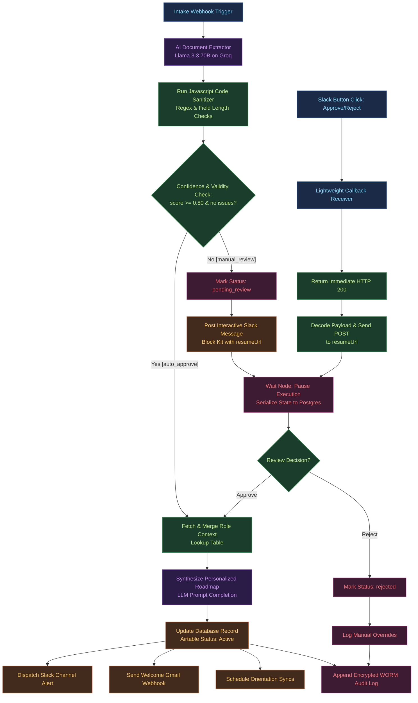

# AI Onboarding Automation Workflow Diagram

The following Mermaid diagram illustrates the end-to-end event-driven flow of the onboarding orchestrator. It outlines the intake trigger, automated field extraction, validation routing split, and the non-blocking Human-in-the-Loop (HITL) review loop.

### Architectural Highlights

1. **Non-Blocking Approvals (Flat Webhook Orchestration):** Using an n8n `Wait` node or API-based state storage avoids active memory consumption while waiting for human reviews. State is serialized to a database, freeing up execution threads.
2. **Deterministic Validation:** LLM extraction is paired with local code-based regex validations (for email addresses) and length checks (for names), ensuring that low-quality extractions are caught before database writes.
3. **Decoupled Client Dependencies:** The backend prototype leverages dependency injection for LLM APIs, enabling mocking for offline testing and preventing runtime vendor lock-in.
